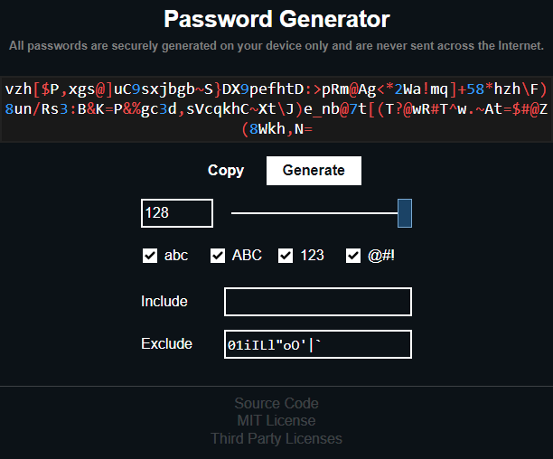

<h1 align="center">Password Generator</h1>

    <a href="https://michal037.github.io/password-generator/">
         
        Click Here To Try Password Generator
    </a>

## Features
* Only on the client-side using JavaScript
* Cryptographically strong pseudo-random values generator
* All printable ASCII characters available
* From length 4, there is certainty to draw at least one random character of selected character group in a random position
* Include and exclude section
* Default exclusion of ambiguous characters (modifiable)
* Works as offline Progressive Web App friendly to mobile devices
* Dark theme
* Separate color for character groups

## Contributors
Thank you for your contribution to this software:

* Mandip Lal Joshi [@MandipJoshi][MandipJoshi]

## License
This software is licensed under the MIT License. See the [license file](LICENSE.txt) for details.

[MandipJoshi]: https://github.com/MandipJoshi
